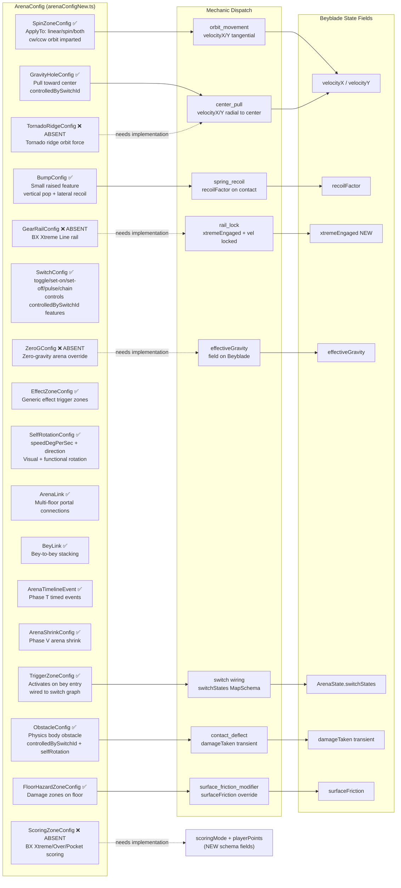
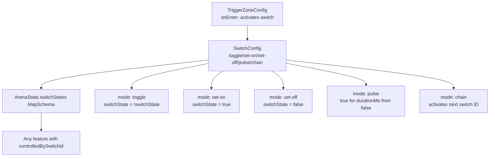

# Diagram 4 — Arena → Mechanic → Beyblade Interaction

Arena configuration features and how each maps to mechanics and Beyblade state fields.
Based on real feature types found in `client/src/types/arenaConfigNew.ts` and `ArenaFeatureProcessor.ts`.

## Arena Feature → Mechanic → Multi-Engine Table

| Feature | Mechanic | 2D Implementation | 2.5D Implementation | 3D Implementation | Shared Logic |
|---------|---------|-------------------|--------------------|--------------------|-------------|
| Spin zone | `orbit_movement` | Tangent force vector from zone center | Same + height profile of zone | Physical spin field mesh | Zone entry check + force magnitude |
| Gravity well | `center_pull` | Radial force vector toward center | Radial + slope contribution from ridge height | Force field physics | Radius + pull strength params |
| Bump | `spring_recoil` | Spring force on contact, lateral recoil | Spring + z-elevation pop | Constraint spring + mesh bounce | Contact threshold + recoil params |
| Obstacle | `contact_deflect` | Angle-cone check, reduce damage | Same + vertical component check | Mesh collision angle check | Approach angle gate |
| Floor hazard | `surface_friction_modifier` | surfaceFriction override in zone | Same + traction on slope | Material override in mesh | Zone overlap check |
| Water zone | `surface_friction_modifier` | surfaceFriction set to water value | Same + buoyancy force | Water simulation | Zone type = water |
| Gear rail | `rail_lock` (NEW) | Nearest polyline segment lock + boost | Same + z-elevation follows rail height | Constrained path physics | requiresGearCompatibleBit check |
| Scoring zone | scoring handlers (NEW) | Zone overlap → point award | Same | Same | Zone kind: xtreme/over/pocket/ring-out |
| Tornado ridge | `center_pull` + `orbit_movement` | Radial pull + tangent orbit | Radial + height profile | Physical ridge mesh | Combined center + tangent forces |
| Zero-g | `effectiveGravity` override | Reduce/remove downward drift | Same + suction/adhesion still active | Gravity vector override | hasZeroG flag → effectiveGravity |

## Switch Wiring Flow

