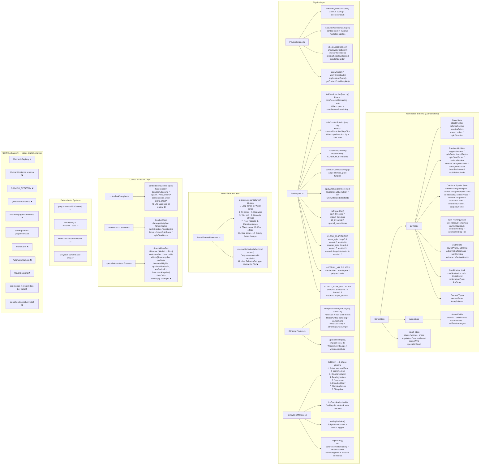

# Diagram 1 — Engine Capabilities Map

Full map of existing engine capabilities. All nodes represent real, discovered entities from Stage 0A code reading.

## MechanicRegistry Draft Slot Assignments

| Existing Function | Draft MechanicRegistry ID | File |
|-------------------|--------------------------|------|
| `tickSpinInjection()` | `energy_reserve` | PartPhysics.ts |
| `tickCounterRotation()` | `rotation_reverse` | PartPhysics.ts |
| `computeSpinSteal()` | `spin_transfer` | PartPhysics.ts |
| `computeContactDamage()` (angle) | `contact_deflect` | PartPhysics.ts |
| `applyStatModifier()` | `mode_switch` dispatcher | PartPhysics.ts |
| `computeClimbingForces()` suction | `bearing_drift` | ClimbingPhysics.ts |
| `processArenaFeatures()` spin zones | `orbit_movement` | ArenaFeatureProcessor.ts |
| `processArenaFeatures()` gravity wells | `center_pull` | ArenaFeatureProcessor.ts |
| `processArenaFeatures()` bumps | `spring_recoil` | ArenaFeatureProcessor.ts |
| `tickCombinationLock()` | `combination_lock` | PartSystemManager.ts |
| BattleRoom.ts spin.drain_target (partial) | `spin_transfer` | BattleRoom.ts |
| NEW: rail proximity detection | `rail_lock` | new mechanics/movement.ts |
| NEW: weight + inertia modifier | `weight_shift` | new mechanics/contact.ts |
| NEW: free spin (bearing) | `free_spin` | new mechanics/spin.ts |
| NEW: rubber contact friction | `rubber_grip` | new mechanics/contact.ts |
| NEW: threshold-based mode change | `spin_threshold_switch` | new mechanics/mode.ts |
| NEW: bidirectional spin equalization | `spin_equalization` | new mechanics/spin.ts |
| NEW: burst resistance dynamic | `burst_suppress` | new mechanics/mode.ts |
| NEW: glancing spin steal | `spin_steal_coupling` | new mechanics/contact.ts |
| NEW: radial velocity impulse | `velocity_burst` | new mechanics/energy.ts |
| NEW: attack multiplier + timer | `attack_amplifier` | new mechanics/energy.ts |
| NEW: stamina recovery per tick | `stamina_recovery` | new mechanics/spin.ts |
| NEW: surfaceFriction override | `surface_friction_modifier` | new mechanics/mode.ts |
| NEW: orbit tangent force | (wraps existing AFP orbit) | new mechanics/movement.ts |
| NEW: center-pull radial force | (wraps existing AFP gravity) | new mechanics/movement.ts |
