# Diagram 2 — Mechanics Composition Map

Mechanics composition map — how atomic mechanics compose into gimmicks, then into beyblades.
Grows continuously as Stages 1–9 produce new discoveries.

```mermaid
flowchart TD
  subgraph Level1["Level 1 — Mechanics (atomic field modifiers)"]
    M_ER[energy_reserve\ncoreReserveRemaining + attackBuffTimer]
    M_VB[velocity_burst\nvelocityX / velocityY impulse]
    M_AA[attack_amplifier\ncomboDamageMultiplier + timer]
    M_FS[free_spin\nspinDecayRate↓ + spinStealResist↑]
    M_ST[spin_transfer\nspinStealFactor transient]
    M_SE[spin_equalization\nspinStealFactor bidirectional]
    M_RR[rotation_reverse\nspinDirection flip]
    M_STS[spin_threshold_switch\naggressiveness + gripFactor + surfaceFriction]
    M_MS[mode_switch\naggressiveness + gripFactor + surfaceFriction set]
    M_RG[rubber_grip\ngripFactor + aggressiveness on contact]
    M_CD[contact_deflect\ndamageTaken transient + recoilFactor on opponent]
    M_SR[spring_recoil\nrecoilFactor on contact]
    M_WS[weight_shift\nmass + knockbackDistance]
    M_SSC[spin_steal_coupling\nspinStealFactor glancing angle]
    M_RL[rail_lock\nxtremeEngaged + velocityX/Y locked]
    M_CP[center_pull\nvelocityX/Y radial toward center]
    M_BD[bearing_drift\nsurfaceFriction↓ + lateral velocity]
    M_BS[burst_suppress\nburstResistance dynamic boost]
    M_STAMREC[stamina_recovery\nspin + maxStamina per tick]
    M_SFM[surface_friction_modifier\nsurfaceFriction override]
    M_OM[orbit_movement\nvelocityX/Y tangential]
    M_CL[combination_lock\ncombinationLocked + linkedBeyId]
    M_POS[position_swap\nvelocityX/Y position exchange]
    M_PROJ[projectile_spawn\nspawn physics body]
  end

  subgraph Level5["Level 5 — Gimmicks (named mechanic recipes)"]
    G_EG[engine_gear\nMechanics: energy_reserve + velocity_burst + attack_amplifier]
    G_FD[final_drive\nMechanics: spin_threshold_switch + mode_switch]
    G_BZ[bearing_zombie\nMechanics: free_spin + spin_equalization]
    G_MSL[movable_sub_layer\nMechanics: burst_suppress]
    G_HW[heavy_wheel\nMechanics: weight_shift]
    G_AD[ad145_deflect\nMechanics: contact_deflect]
    G_XD[xtreme_dash\nMechanics: rail_lock]
    G_SSC[spin_steal_coupling\nMechanics: spin_steal_coupling]
    G_TS[tornado_stall\nMechanics: center_pull + orbit_movement]
    G_RG[rubber_grip_tip\nMechanics: rubber_grip + surface_friction_modifier]
    G_LAD[life_after_death\nMechanics: free_spin + bearing_drift + stamina_recovery]
    G_CR[counter_rotation\nMechanics: rotation_reverse]
    G_CL[combination_lock\nMechanics: combination_lock]
  end

  subgraph Level8["Level 8 — Beyblades (assembled gimmick sets)"]
    B_DG[dranzer-g\ngimmickIds: engine_gear]
    B_ADV[advance-averazer\ngimmickIds: spin_steal_coupling + bearing_zombie]
    B_BAS[basalt-horogium-145wd\ngimmickIds: heavy_wheel]
    B_BBP[big-bang-pegasus-fd\ngimmickIds: final_drive]
    B_ARC[arc-bahamut\ngimmickIds: movable_sub_layer]
    B_XBX[X beyblades\ngimmickIds: xtreme_dash + x-bit gimmicks]
    B_DISC["... 334+ beyblades\n(all mapped via gimmickIds)"]
  end

  M_ER --> G_EG
  M_VB --> G_EG
  M_AA --> G_EG

  M_STS --> G_FD
  M_MS --> G_FD

  M_FS --> G_BZ
  M_SE --> G_BZ

  M_BS --> G_MSL

  M_WS --> G_HW

  M_CD --> G_AD

  M_RL --> G_XD

  M_SSC --> G_SSC

  M_CP --> G_TS
  M_OM --> G_TS

  M_RG --> G_RG
  M_SFM --> G_RG

  M_FS --> G_LAD
  M_BD --> G_LAD
  M_STAMREC --> G_LAD

  M_RR --> G_CR

  M_CL --> G_CL

  G_EG --> B_DG
  G_SSC --> B_ADV
  G_BZ --> B_ADV
  G_HW --> B_BAS
  G_FD --> B_BBP
  G_MSL --> B_ARC
  G_XD --> B_XBX
  B_DISC --> Level8
```

## Mechanic → Existing Field Mapping Table

| Mechanic ID | Level 1 Fields Modified | Source Function |
|-------------|------------------------|----------------|
| `energy_reserve` | `coreReserveRemaining`, `spin`, `attackBuffTimer` | `tickSpinInjection()` |
| `velocity_burst` | `velocityX`, `velocityY` | `applyForce()` in PhysicsEngine |
| `attack_amplifier` | `comboDamageMultiplier`, `comboDamageMultiplierTimer` | `applyStatModifier()` |
| `free_spin` | `spinDecayRate` (lower decay), `spinStealResist` (higher) | derived from staminaPoints formula |
| `spin_transfer` | `spinStealFactor` (transient) | `computeSpinSteal()` |
| `spin_equalization` | `spinStealFactor` (bidirectional) | `computeSpinSteal()` bidirectional |
| `rotation_reverse` | `spinDirection` flip | `tickCounterRotation()` |
| `spin_threshold_switch` | `aggressiveness`, `gripFactor`, `surfaceFriction` | `isTriggerMet()` + `applyStatModifier()` |
| `mode_switch` | `aggressiveness`, `gripFactor`, `surfaceFriction` | `applyStatModifier()` |
| `rubber_grip` | `gripFactor`, `aggressiveness` | `getContactPointMultiplier()` + material |
| `contact_deflect` | `damageTaken` transient, opponent `recoilFactor` | `computeContactDamage()` angle-cone |
| `spring_recoil` | `recoilFactor` | `calculateCollisionDamage()` BumpConfig |
| `weight_shift` | `mass`, `knockbackDistance` (derived) | `mass` field direct |
| `spin_steal_coupling` | `spinStealFactor` (glancing) | `computeSpinSteal()` + angle gate |
| `rail_lock` | `xtremeEngaged` (new), `velocityX/Y` locked | new field + `applyForce()` |
| `center_pull` | `velocityX`, `velocityY` | existing gravity well force in AFP |
| `bearing_drift` | `surfaceFriction`, lateral velocity | `computeClimbingForces()` suction |
| `burst_suppress` | `burstResistance` (dynamic) | `applyStatModifier()` |
| `stamina_recovery` | `spin`, `maxStamina` | `applyStatModifier()` |
| `surface_friction_modifier` | `surfaceFriction` | `applyStatModifier()` |
| `orbit_movement` | `velocityX/Y` tangential | existing AFP orbit force |
| `combination_lock` | `combinationLocked`, `linkedBeyId` | `tickCombinationLock()` |
| `position_swap` | `velocityX/Y` exchange | `applyForce()` |
| `projectile_spawn` | spawn new physics body | new handler |
