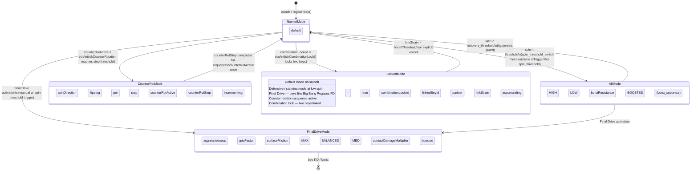

# Diagram 3 — Mode Change State Machine

Mode change flow — how spin-threshold and explicit mode switches alter runtime field values.
Trigger conditions and stat values are updated as Stage 7 bey research validates exact thresholds.

## Mode Change Trigger Table

| Trigger Type | Field Checked | Condition | Mode Change | Mechanic | Source |
|-------------|---------------|-----------|-------------|----------|--------|
| `spin_threshold` | `bey.spin / bey.maxSpin` | < threshold value | NormalMode → AltMode | `spin_threshold_switch` | `isTriggerMet()` in PartPhysics.ts |
| `spin_recovery` | `bey.spin / bey.maxSpin` | > recovery_threshold | AltMode → NormalMode | `spin_threshold_switch` | `isTriggerMet()` |
| `final_drive_activate` | spin OR manual | explicit or threshold | any → FinalDriveMode | `mode_switch` | `applyStatModifier()` |
| `counter_rotation_start` | combo/special trigger | `counterRotActive = true` | NormalMode → CounterRotMode | `rotation_reverse` | `tickCounterRotation()` |
| `counter_rotation_complete` | `counterRotStep` | step count exhausted | CounterRotMode → NormalMode | `rotation_reverse` | `tickCounterRotation()` |
| `combination_lock` | `combinationLocked` | two beys proximity + trigger | NormalMode → LockedMode | `combination_lock` | `tickCombinationLock()` |
| `combination_break` | `linkStrain` | > break threshold | LockedMode → NormalMode | `combination_lock` | `tickCombinationLock()` |

## Mode Config Table

| Config | Available Values | Effect | Evidence | Confidence |
|--------|-----------------|--------|----------|-----------|
| `spin_threshold` param | 0.0–1.0 (fraction of maxSpin) | Spin level that triggers mode switch | isTriggerMet spin_threshold case | HIGH |
| `recovery_threshold` param | 0.0–1.0 | Hysteresis guard — prevents flapping | needed for AltMode → NormalMode | INFERENCE |
| `aggressiveness` target | float32 | Movement aggressiveness in new mode | applyStatModifier whitelist | HIGH |
| `gripFactor` target | float32 | Floor traction in new mode | applyStatModifier whitelist | HIGH |
| `surfaceFriction` target | float32 | Surface friction in new mode | applyStatModifier whitelist | HIGH |
| `burstResistance` boost | float32 delta | Dynamic burst protection in alt mode | burst_suppress mechanic | HIGH |
| `counterRotStep` count | uint8 | Steps in counter-rotation sequence | tickCounterRotation | HIGH |
| `counterRotStepTick` | float32 ticks/step | Duration per step | tickCounterRotation | HIGH |
