# Diagram 7 — Presentation Flow (Cross-Cutting Layer)

Presentation triggers from every level of the composition hierarchy. Presentation is client-side only — server sends state changes; client interprets them as presentation cues. This decoupling is preserved.

```mermaid
flowchart TD
  subgraph Triggers["Composition Hierarchy — Presentation Sources"]
    L1[Level 1 Mechanics\nenergy_reserve / velocity_burst / spin_transfer\nrail_lock / contact_deflect / spring_recoil]
    L4[Level 4 Combos\nguard-tap / power-thrust / spin-leech-jab\nriposte / pivot-strike]
    L5[Level 5 Gimmicks\nengine_gear / final_drive / bearing_zombie\nextreme_dash / xtreme_line]
    L6[Level 6 Special Moves\nstampede_rush / gyro_anchor / spin_recovery\ntactical_burst / shock_pulse]
    L9[Level 9 Arena Features\ntornado ridge / gear rail / scoring zones\nspin zones / gravity wells / bumps]
    EVENTS[Game Events\nKO / burst / ring-out / series win]
  end

  subgraph PresentationLayers["9 Presentation Layers (Rule 6)"]
    L_GAME[Layer 1: Gameplay Logic\nstat mods / burst / KO / win condition]
    L_MOV[Layer 2: Movement Logic\nvelocity / forces / orbit / drift / lock]
    L_CAM[Layer 3: Camera Logic\nshake / zoom / cinematic cut / follow]
    L_AUD[Layer 4: Audio Logic\nSFX / music stings / spatial audio]
    L_VFX[Layer 5: Visual Effects\nparticles / trails / flash / distortion]
    L_ASS[Layer 6: Asset Layer\nsprite swaps / part overlays / VFX assets]
    L_ARN[Layer 7: Arena Reactions\nhazard response / zone triggers / world-state]
    L_WLD[Layer 8: World State\npersistent transform / mode change / env shift]
    L_TRN[Layer 9: Runtime Transitions\nmulti-stage sequencing / timing]
  end

  subgraph CameraOutputs["Camera Outputs"]
    CAM_SHAKE[shake\non collision / burst / KO]
    CAM_ZOOM[zoom\non special / clash / rail exit]
    CAM_CUT[cinematic cut\non KO / series end / special move peak]
    CAM_FOLLOW[follow\nspectator tracking / auto-framing]
  end

  subgraph AudioOutputs["Audio Outputs"]
    AUD_SFX[SFX\nspin hum / clash / burst / KO / rail ride]
    AUD_STING[music sting\nspecial move activation / series win]
    AUD_SPATIAL[spatial audio\npositional SFX per arena zone]
    AUD_ENV[environmental\narena reverb / ambience type]
  end

  subgraph VFXOutputs["VFX Outputs"]
    VFX_PARTICLES[particles\nspin trail / burst explosion / rail sparks]
    VFX_TRAILS[trails\nvelocity trail / special move trail]
    VFX_FLASH[screen flash\non clash / KO / mode change]
    VFX_DISTORTION[distortion\nshockwave / tornado / rail warp]
  end

  subgraph WorldStateOutputs["World State Outputs"]
    WLD_TRANSFORM[persistent transform\nmode-change visual — bey geometry swap]
    WLD_MODE[mode change\narena lighting shift on zero-g / tornado]
    WLD_ENV[environment shift\nzero-g float effect / rain / lava glow]
  end

  L1 --> L_MOV
  L1 --> L_VFX
  L1 --> L_AUD

  L4 --> L_GAME
  L4 --> L_MOV
  L4 --> L_VFX
  L4 --> L_AUD

  L5 --> L_GAME
  L5 --> L_MOV
  L5 --> L_CAM
  L5 --> L_VFX
  L5 --> L_WLD

  L6 --> L_GAME
  L6 --> L_MOV
  L6 --> L_CAM
  L6 --> L_AUD
  L6 --> L_VFX
  L6 --> L_ASS
  L6 --> L_TRN

  L9 --> L_ARN
  L9 --> L_WLD
  L9 --> L_AUD
  L9 --> L_VFX

  EVENTS --> L_CAM
  EVENTS --> L_AUD
  EVENTS --> L_VFX
  EVENTS --> L_TRN

  L_CAM --> CAM_SHAKE
  L_CAM --> CAM_ZOOM
  L_CAM --> CAM_CUT
  L_CAM --> CAM_FOLLOW

  L_AUD --> AUD_SFX
  L_AUD --> AUD_STING
  L_AUD --> AUD_SPATIAL
  L_AUD --> AUD_ENV

  L_VFX --> VFX_PARTICLES
  L_VFX --> VFX_TRAILS
  L_VFX --> VFX_FLASH
  L_VFX --> VFX_DISTORTION

  L_WLD --> WLD_TRANSFORM
  L_WLD --> WLD_MODE
  L_WLD --> WLD_ENV
```



## Presentation Trigger Table (Stage 0 baseline — grows through research)

| Trigger Level | Mechanic/Gimmick/Move/Event | Layer Affected | Presentation Type | Evidence / Source |
|--------------|----------------------------|---------------|-------------------|------------------|
| Mechanic | `velocity_burst` (dash/impulse) | 2 Movement, 5 VFX | velocity trail, speed blur | PhysicsEngine applyForce |
| Mechanic | `spin_transfer` (spin steal contact) | 4 Audio, 5 VFX | steal SFX, particle spark | computeSpinSteal |
| Mechanic | `contact_deflect` (angle deflect) | 3 Camera, 4 Audio, 5 VFX | camera shake, clash SFX, impact flash | computeContactDamage |
| Mechanic | `spring_recoil` (bump hit) | 3 Camera, 4 Audio, 5 VFX | shake, bump SFX, pop particles | BumpConfig processor |
| Mechanic | `rotation_reverse` (counter-rot) | 5 VFX, 8 World State | spin direction change glow, spiral trail | tickCounterRotation |
| Mechanic | `energy_reserve` fire | 2 Movement, 4 Audio, 5 VFX | speed trail, energy burst SFX, spark burst | tickSpinInjection fire |
| Mechanic | `rail_lock` (xtreme dash) | 2 Movement, 3 Camera, 4 Audio, 5 VFX | rail camera track, rail SFX, sparks trail | rail proximity → xtremeEngaged |
| Gimmick | `engine_gear` activate | 3 Camera, 4 Audio, 5 VFX, 9 Transition | gear spin-up sound, burst particle, zoom | energy_reserve fire |
| Gimmick | `final_drive` switch | 8 World State, 5 VFX, 4 Audio | mode change glow, transformation SFX | spin_threshold_switch |
| Gimmick | `bearing_zombie` (LAD) | 5 VFX, 4 Audio | low-spin drift glow, eerie humming | free_spin + bearing_drift |
| Combo | Any combo activation | 1 Gameplay, 5 VFX | combo flash, activation particles | ComboHUD.tsx |
| Combo | `power-thrust` (JJJ) | 2 Movement, 5 VFX | charge glow, thrust trail | comboEffect.forceImpulse |
| Combo | `spin-leech-jab` | 4 Audio, 5 VFX | leech sound, drain beam VFX | spinStealBonus field |
| Special | `stampede_rush` | 2 Movement, 3 Camera, 4 Audio, 5 VFX, 9 Transition | cinematic zoom, rush SFX, trail blast | SpecialMoveDef.flashColor |
| Special | `gyro_anchor` | 1 Gameplay, 3 Camera, 4 Audio, 5 VFX | anchor glow, defensive SFX, invuln pulse | invulnerabilityMs field |
| Special | `spin_recovery` | 2 Movement, 5 VFX, 4 Audio | orbit trail, recovery hum | Orbital force |
| Special | `shock_pulse` | 3 Camera, 4 Audio, 5 VFX | shockwave, radial flash, AoE SFX | aoeRadiusPx field |
| Arena | Spin zone entry | 2 Movement, 5 VFX | orbit glow, spin zone particles | SpinZoneConfig |
| Arena | Gravity well pull | 2 Movement, 5 VFX | pull particles, center glow | GravityHoleConfig |
| Arena | Bump hit | 3 Camera, 4 Audio, 5 VFX | bump SFX, pop VFX, camera shake | BumpConfig |
| Event | KO (burst) | 3 Camera, 4 Audio, 5 VFX, 9 Transition | burst explosion, cinematic cut, burst SFX | state.winner set |
| Event | Ring-out | 3 Camera, 4 Audio, 5 VFX | pan to edge, ring-out SFX, fade | isOutOfBounds |
| Event | Series win | 3 Camera, 4 Audio, 8 World State | victory music sting, arena light shift | state.status = series-finished |

## Simulation ↔ Presentation Boundary

```
SERVER (authoritative simulation)          CLIENT (presentation only)
─────────────────────────────────          ──────────────────────────
Schema state changes (60Hz patch)    →     onStateChange handler
  bey.spin decreases                 →     spin hum pitch changes
  bey.xtremeEngaged = true           →     rail spark trail activates
  bey.comboDamageMultiplier > 1      →     combo glow activates
  state.winner set                   →     burst cinematic fires
  bey.beyTiltAngle increases         →     wobble visual increases
  bey.adhering = true                →     wall adhesion VFX plays
  arena.switchStates changes         →     switch activation animation
```

**Critical rule**: Server NEVER sends presentation commands. Client ALWAYS derives presentation from state delta. This preserves determinism and replay compatibility.
