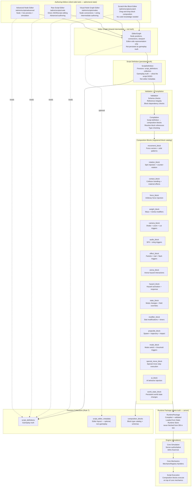

# Diagram 16 — Script Authoring Flow

Users may extend behavior via composition blocks. Visual blocks are authoring tools — NOT runtime truth. The script definition is the persistent truth. Runtime packages are the game truth. Editor state is ephemeral.

## Script Source of Truth Rules

| Item | Is Truth? | Where Stored | Notes |
|------|---------|-------------|-------|
| ScriptDefinition | ✅ YES — gameplay truth | `script_definitions` Firestore | What the script DOES |
| EditorGraph positions | ❌ NO — editor state | `script_editor_metadata` (optional) | Layout only |
| Visual block drag state | ❌ NO — ephemeral | Client memory only | Not persisted |
| Viewport scroll position | ❌ NO — ephemeral | Client memory only | Not persisted |
| Compiled RuntimePackage | ✅ YES — game truth | Static Runtime Store | Derived from ScriptDefinition |
| Composition block catalog | ✅ YES — authoring truth | `composition_blocks` Firestore | Block type registry |

## What Scripts May and May NOT Do

| May Do | May NOT Do |
|--------|-----------|
| Use composition block APIs | Replace physics simulation |
| Trigger presentation events (camera, audio, VFX) | Bypass deterministic core |
| Modify stat fields (via mechanic handlers) | Query databases at runtime |
| Compose mechanics into new sequences | Modify deterministic PRNG seed |
| Reference events (collision, tick, activation) | Inject runtime state from client |
| Use conditions (spin threshold, timer, health) | Override server-authoritative simulation |
| Chain multiple blocks sequentially | Access other players' private state |
| Query bey state (read only) | Execute arbitrary server code |

## Sandbox Requirement

Scripts execute in a sandboxed environment:
- Only composition block APIs exposed (not raw physics engine)
- No access to raw Firestore, network, or server filesystem
- No access to `Math.random()` — must use seeded PRNG API
- Execution time-limited per tick (prevent infinite loops)
- Side effects limited to: field modifications via whitelisted mechanic handlers + presentation event emission
