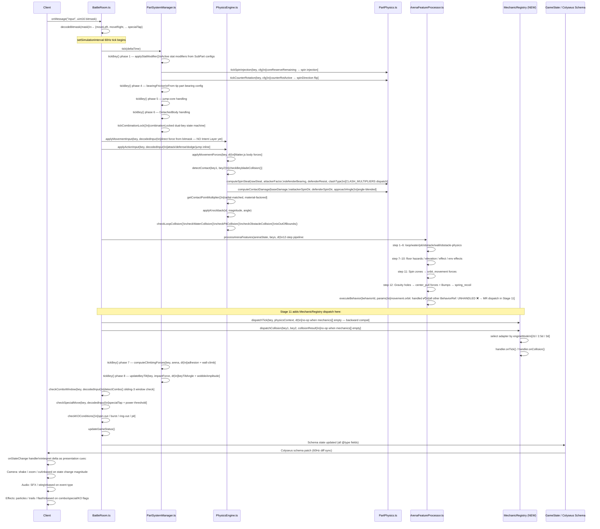

# Diagram 6 — Full Tick Sequence

Full tick sequence from input through state update to client presentation.
All function names are real, discovered in Stage 0A code reading.

## Tick Loop Order (20-Step — BattleRoom.ts confirmed)

| Step | Operation | Function |
|------|-----------|---------|
| 1 | Process pending inputs | `decodeBitmask()` per player |
| 2 | PSM tick (8-phase) | `partSystemManager.tick()` |
| 3 | Apply movement forces | `applyMovementInput()` |
| 4 | Apply action forces | `applyActionInput()` |
| 5 | Physics step | Matter.js `Engine.update()` |
| 6 | Contact detection | `checkBeybladeCollision()` |
| 7 | Contact resolution | `computeSpinSteal()` + `computeContactDamage()` |
| 8 | Knockback application | `applyKnockback()` |
| 9 | Zone checks | `checkLoopCollision()` ... `isOutOfBounds()` |
| 10 | Arena features | `processArenaFeatures()` |
| 11 | BehaviorRef execution | `executeBehavior()` (partial) |
| 12 | MechanicRegistry tick (NEW) | `MechanicRegistry.dispatchTick()` |
| 13 | MechanicRegistry collision (NEW) | `MechanicRegistry.dispatchCollision()` |
| 14 | Climbing forces | within PSM phase 7 |
| 15 | Tilt update | within PSM phase 8 |
| 16 | Combo window check | `detectCombo()` |
| 17 | Special move check | `checkSpecialMove()` |
| 18 | KO condition check | `checkKOConditions()` |
| 19 | Game status update | `updateGameStatus()` |
| 20 | Schema sync | Colyseus auto-patch to clients |
