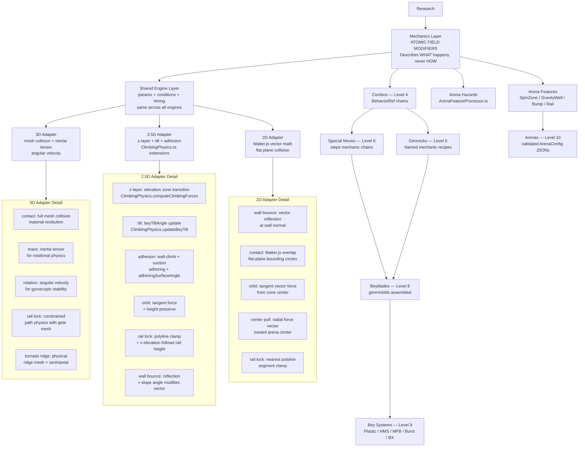

# Diagram 5 — Simulation Architecture (Three-Engine)

Three simulation engine architecture. Mechanics describe WHAT happens; adapters describe HOW it happens in each engine. Simulation and rendering are decoupled — a 2D simulation can have a 3D renderer.

## Multi-Engine Parity Rules

| Rule | Constraint |
|------|-----------|
| Behavior Identity | All engines preserve core gimmick identity, movement identity, contact behavior |
| Difference Scope | Differences are only in simulation accuracy and collision precision — never in intended behavior |
| Simulation ≠ Rendering | Simulation engine and renderer are decoupled; a 2D simulation can have a 3D renderer |
| Mechanic Params | Shared params are the same across all engines; adapters interpret them differently |
| No Feature Gating | No mechanic or gimmick is "2D only" or "3D only" — all three must be supported |

## Required Tables Per Mechanic (from Rule 2)

Every mechanic defined in Stage 6 must have this table:

| Mechanic | 2D Implementation | 2.5D Implementation | 3D Implementation | Shared Behavior |
|---------|-------------------|--------------------|--------------------|----------------|
| `energy_reserve` | charge float → fire impulse | same + airborne check | same | coreReserveRemaining + threshold fire |
| `velocity_burst` | direct vector impulse | vector + z-component clamp | physics body force | magnitude + direction params |
| `orbit_movement` | tangent force from zone center | tangent + height preserve | angular velocity path | radius + speed params |
| `center_pull` | radial force vector | radial + slope contribution | force field | radius + pull strength |
| `spring_recoil` | spring force on contact | spring + elevation | constraint spring | restitution + threshold |
| `free_spin` | lower spinDecayRate | lower decay + tilt resistance | bearing friction model | decay rate modifier |
| `spin_transfer` | on contact overlap | on contact + elevation | collision impulse | CLASH_MULTIPLIERS |
| `rail_lock` | nearest polyline segment lock | lock + z-elevation on rail | constrained path physics | requiresGearCompatibleBit |
| `rubber_grip` | contact friction mult | same + surface normal | material friction | gripFactor modifier |
| `burst_suppress` | threshold boost | same | same | burstResistance delta |
| `weight_shift` | modify effective mass | same + center-of-mass | inertia tensor update | mass delta |

## Missing Support Tracking (per batch)

| Feature | 2D | 2.5D | 3D | Required Work |
|---------|-----|------|-----|---------------|
| Gear rail (BX) | ❌ | ❌ | ❌ | GearRailConfig + rail_lock mechanic all engines |
| Tornado ridge | ⚠️ partial (gravity well) | ⚠️ partial | ❌ | TornadoRidgeConfig + combined forces |
| Zero-G | ⚠️ partial (effectiveGravity) | ⚠️ partial | ❌ | ZeroGConfig + gravity vector override |
| Scoring zones | ❌ | ❌ | ❌ | ScoringZoneConfig + playerPoints schema |
| Visual scripting | ❌ | ❌ | ❌ | Stage 15 — editor + runtime blocks |
