# Diagram: Engine Capabilities Map

> **Stage 0C Diagram 1** — Full engine capability map.

```mermaid
graph TD
  subgraph "SERVER ENGINE (Colyseus + Matter.js)"
    PE[PhysicsEngine<br/>Matter.js 60Hz]
    PP[PartPhysics<br/>2.5D extensions]
    CP[ClimbingPhysics<br/>wall/ceiling]
    AFP[ArenaFeatureProcessor<br/>shared hazards]
    SMS[SpecialMoveSystem<br/>state machine]
    CS[ComboSystem<br/>detect + trigger]
    CTC[ComboTaskCompiler<br/>Task→BehaviorRef]
    ETL[ElementTypeLoader<br/>Firestore matrix]
    AI[AIController<br/>medium/hard/hell]
    SM[SeriesManager<br/>BO1/3/5]
    IH[InputHandler<br/>bitmask→forces]
    RM[RoundModifiers<br/>MODIFIER_MAP]
  end

  subgraph "SCHEMA (Colyseus @Schema)"
    GS[GameState]
    BEY[Beyblade<br/>80+ fields]
    AS[ArenaState]
    LS[LoopState]
    OS[ObstacleState]
    PS[PitState]
    TS[TurretState]
    PROJ[ProjectileState]
    WS[WaterBodyState]
    POS[PortalState]
    DBS[DetachedBodySchema]
  end

  subgraph "SHARED TYPES (compiled at save time)"
    SM_T[SpecialMoveConfig<br/>steps→ComboEffectId]
    CT[ComboTask<br/>5 action types]
    BR[BehaviorRef<br/>engine steps]
    SD[StatDelta<br/>29 keys]
    CED[ComboEffectDef<br/>tasks+steps]
    BS[BeybladeSystem<br/>2.5D parts]
  end

  subgraph "ROOMS"
    TR[TryoutRoom<br/>solo]
    BR2[BattleRoom<br/>PVP 2–4]
    AIR[AIBattleRoom<br/>1v1 AI]
    TBR[TournamentBattleRoom<br/>bracket]
    P25BR[Parts25DBattleRoom<br/>2.5D PVP]
  end

  subgraph "FIREBASE RUNTIME"
    FS[(Firestore)]
    FB_AUTH[Auth]
    FB_STORAGE[Storage]
  end

  PE --> BEY
  PP --> BEY
  CP --> BEY
  AFP --> GS
  SMS --> BEY
  CS --> BEY
  ETL --> FS
  AI --> IH
  SM --> GS
  IH --> BEY
  RM --> GS

  CTC --> BR
  CT --> CTC
  SM_T --> CED
  CED --> BR
  BR --> SMS

  GS --> BEY
  GS --> AS
  GS --> LS
  GS --> OS
  GS --> PS
  GS --> TS
  GS --> PROJ
  GS --> WS
  GS --> POS
  GS --> DBS

  TR --> PE
  BR2 --> PE
  BR2 --> PP
  AIR --> PE
  AIR --> AI
  TBR --> PE
  P25BR --> PP

  BR2 --> FS
  TR --> FS
  AIR --> FS
  TBR --> FS
```

## Capability Summary Table

| System | Status | Gap |
|--------|--------|-----|
| 2D physics (Matter.js) | ✅ Complete | — |
| 2.5D part physics | ✅ Complete | — |
| 3D physics | ❌ Not built | Needs new adapter |
| Arena hazards (7 types) | ✅ Complete | — |
| BehaviorRef dispatcher | ⚠️ PARTIAL — only movement.orbit | 19+ handlers missing |
| Special move pipeline | ✅ Compiled / ⚠️ runtime gap | Firestore→runtime link unconfirmed |
| Combo system (sequence + trigger) | ✅ Complete | — |
| Element types | ✅ Complete | — |
| Round modifiers | ✅ Complete | — |
| AI (medium/hard/hell) | ✅ Complete | — |
| Series manager (BO1/3/5) | ✅ Complete | — |
| Tournament system | ✅ Complete | — |
| Combination lock (BeyLink) | ⚠️ Types + schema; physics depth unconfirmed | — |
| Arena rotation + shrink | ✅ Complete | — |
| Sub-part detachment lifecycle | ✅ Complete | — |
