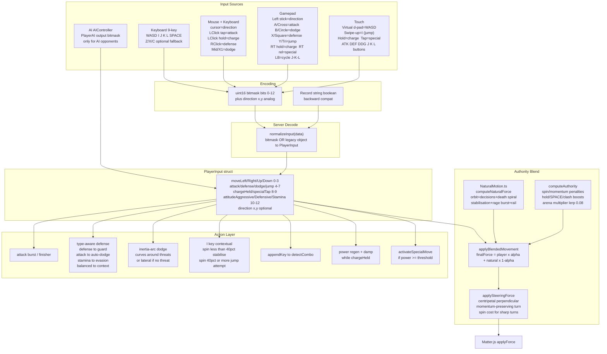

[← Extraction Pipeline](diagram-extraction-pipeline.md) &nbsp;·&nbsp; [↑ Index](../INDEX.md) &nbsp;·&nbsp; [Mechanics →](diagram-mechanics.md)

---

# Diagram: Input Abstraction

> **Stage 0C Diagram 11 (updated Phase 22)** — Four input sources → PlayerInput → Authority Blend → Physics.

## Bitmask Encoding (bits 0–12)

| Bit | Key | Action |
|-----|-----|--------|
| 0 | moveLeft | A / ← |
| 1 | moveRight | D / → |
| 2 | moveUp | W / ↑ |
| 3 | moveDown | S / ↓ |
| 4 | attack | mouse LClick-tap / Z fallback |
| 5 | defense | mouse RClick / X fallback |
| 6 | dodge | mouse mid/X1 / C fallback |
| 7 | jump (upper-pull) | I key |
| 8 | chargeHeld | SPACE hold / mouse LClick-hold ≥200ms |
| 9 | specialTap | SPACE release / mouse LClick-release |
| 10 | attitudeAggressive | J |
| 11 | attitudeDefensive | K |
| 12 | attitudeStamina | L |
| — | direction {x,y} | cursor / stick analog (non-bitmask) |

## Control Lock Sources

While `Date.now() < controlLockedUntilMs`, movement/action bits are IGNORED:
- Source `"special"` — special move executing (existing)
- Source `"combo"` — combo executing (existing)
- Source `"playerStun"` — heavy collision stun 350ms (Phase 22 §8)
- Source `"aiStun"` — heavy collision AI stun 80ms (Phase 22 §8)
- Source `"aiSurrendered"` — player held >3s; AI defers entirely (Phase 22 §2.2)
- Source `"airborne"` — gripFactor=0 while airborne; no orbit force (Phase 22 §7)

## Authority Blend Layer

`α = computeAuthority()` blends player force with Control AI natural force every tick.
α = 0 → bey fully autonomous. α = 1 → player has full control. Default resting ~0.30.
Smoothed via `lerp(prev, target, 0.08)` — cannot instantly snap to new authority.
See Phase 22 §2 for full formula.

---

[← Extraction Pipeline](diagram-extraction-pipeline.md) &nbsp;·&nbsp; [↑ Index](../INDEX.md) &nbsp;·&nbsp; [Mechanics →](diagram-mechanics.md)
