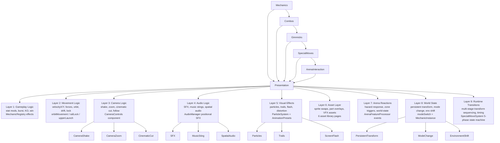

[← Mode Flow](diagram-mode-flow.md) &nbsp;·&nbsp; [↑ Index](../INDEX.md) &nbsp;·&nbsp; [Research Flow →](diagram-research-flow.md)

---

# Diagram: Presentation Flow — 9 Layers

> **Stage 0C Diagram 7** — Rule 6: Presentation is a cross-cutting layer.



## PixiJS Renderer Layer Stack (PixiRenderer.ts)

| z-order | Layer | Contents |
|---------|-------|---------|
| 1 (bottom) | arenaLayer | Arena bowl, background geometry |
| 2 | featureLayer | Obstacles, pits, portals, turrets, water, loops, projectiles, link lines |
| 3 | beybladeLayer | Beyblade circles with glow, stats, shadow sprites |
| 4 | detachedBodyLayer | Projectiles, mini_bey, fragments (DetachedBodySchema) |
| 5 | particleLayer | Particles, meteor landing zones |
| 6 (top) | hudLayer | Health bars, spin rings, power meter (screen space — no camera transform) |

## Current Admin Coverage of Presentation Layers

| Layer | Admin Page | Status |
|-------|-----------|--------|
| 1 Gameplay Logic | RoundModifiersPage, SpecialMovesPage, BehaviorDefsPage | ✅ Complete |
| 2 Movement Logic | BehaviorDefsPage (MechanicRegistry handlers) | ✅ Complete |
| 3 Camera Logic | ❌ camera_profiles not built | MISSING |
| 4 Audio Logic | ❌ audio_profiles not built; SoundAssetsPage = uploads only | MISSING |
| 5 Visual Effects | AnimationPresetsPage + ParticlePresetsPage | ✅ Built (runtime link partial) |
| 6 Asset Layer | All 6 asset library pages | ✅ Complete |
| 7 Arena Reactions | ArenaFeatureConfigsPage, BehaviorDefsPage | ✅ Complete |
| 8 World State | BehaviorDefsPage (modeSwitch, rotationReverse) | ✅ Complete |
| 9 Runtime Transitions | SpecialMoveSystem + ComboEffectsPage | ✅ Complete |

## Simulation vs Presentation Boundary

```
Server side:   tick() → GameState mutation → Colyseus sync
Client side:   Colyseus state change → presentation cues
               (camera, SFX, particles, screen effects)
```

The server sends state changes. The client interprets them as presentation cues.
This decoupling MUST be preserved.

---

[← Mode Flow](diagram-mode-flow.md) &nbsp;·&nbsp; [↑ Index](../INDEX.md) &nbsp;·&nbsp; [Research Flow →](diagram-research-flow.md)
