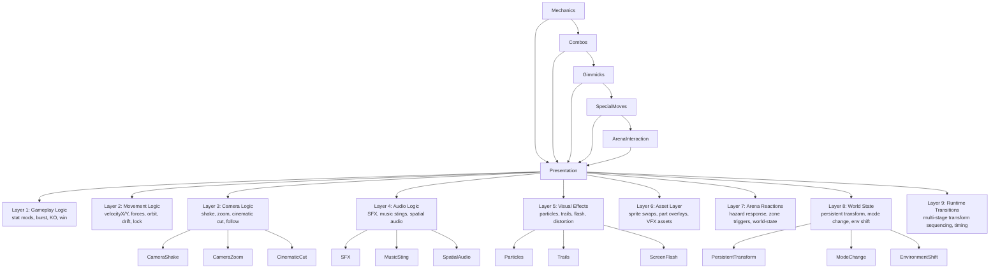

# Diagram: Presentation Flow — 9 Layers

> **Stage 0C Diagram 7** — Rule 6: Presentation is a cross-cutting layer.



## Current Admin Coverage of Presentation Layers

| Layer | Admin Page | Status |
|-------|-----------|--------|
| 1 Gameplay Logic | RoundModifiersPage, SpecialMovesPage | partial |
| 2 Movement Logic | SpecialMovesPage (effects), BehaviorDefsPage | partial |
| 3 Camera Logic | ❌ camera_profiles not built | MISSING |
| 4 Audio Logic | ❌ audio_profiles not built | MISSING |
| 5 Visual Effects | AnimationPresetsPage | partial (not linked) |
| 6 Asset Layer | All asset library pages | ✅ |
| 7 Arena Reactions | ArenaFeatureConfigsPage, BehaviorDefsPage | partial |
| 8 World State | BehaviorDefsPage (switch_logic) | partial |
| 9 Runtime Transitions | BehaviorDefsPage | partial (untyped JSON) |

## Simulation vs Presentation Boundary

```
Server side:   tick() → GameState mutation → Colyseus sync
Client side:   Colyseus state change → presentation cues
               (camera, SFX, particles, screen effects)
```

The server sends state changes. The client interprets them as presentation cues.
This decoupling MUST be preserved.
