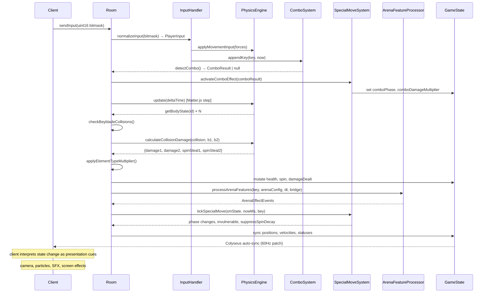

# Diagram: Sequence — Launch to State Update

> **Stage 0C Diagram 6** — Full sequence from launch through collision to client.

```mermaid
sequenceDiagram
  participant Client
  participant Room
  participant InputHandler
  participant PhysicsEngine
  participant ComboSystem
  participant SpecialMoveSystem
  participant ArenaFeatureProcessor
  participant GameState

  Client->>Room: sendInput(uint16 bitmask)
  Room->>InputHandler: normalizeInput(bitmask) → PlayerInput
  InputHandler->>PhysicsEngine: applyMovementInput(forces)
  InputHandler->>ComboSystem: appendKey(key, now)

  ComboSystem-->>Room: detectCombo() → ComboResult | null
  Room->>SpecialMoveSystem: activateComboEffect(comboResult)
  SpecialMoveSystem->>GameState: set comboPhase, comboDamageMultiplier

  Room->>PhysicsEngine: update(deltaTime) [Matter.js step]
  PhysicsEngine-->>Room: getBodyState(id) × N

  Room->>Room: checkBeybladeCollisions()
  Room->>PhysicsEngine: calculateCollisionDamage(collision, b1, b2)
  PhysicsEngine-->>Room: {damage1, damage2, spinSteal1, spinSteal2}
  Room->>Room: applyElementTypeMultiplier()
  Room->>GameState: mutate health, spin, damageDealt

  Room->>ArenaFeatureProcessor: processArenaFeatures(bey, arenaConfig, dt, bridge)
  ArenaFeatureProcessor-->>Room: ArenaEffectEvents

  Room->>SpecialMoveSystem: tickSpecialMove(smState, nowMs, bey)
  SpecialMoveSystem-->>Room: phase changes, invulnerable, suppressSpinDecay

  Room->>GameState: sync positions, velocities, statuses
  GameState-->>Client: Colyseus auto-sync (60Hz patch)

  Note over Client: client interprets state change as presentation cues
  Note over Client: camera, particles, SFX, screen effects
```
