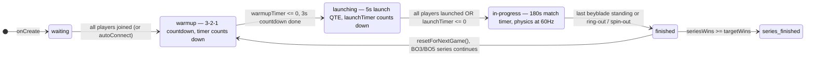
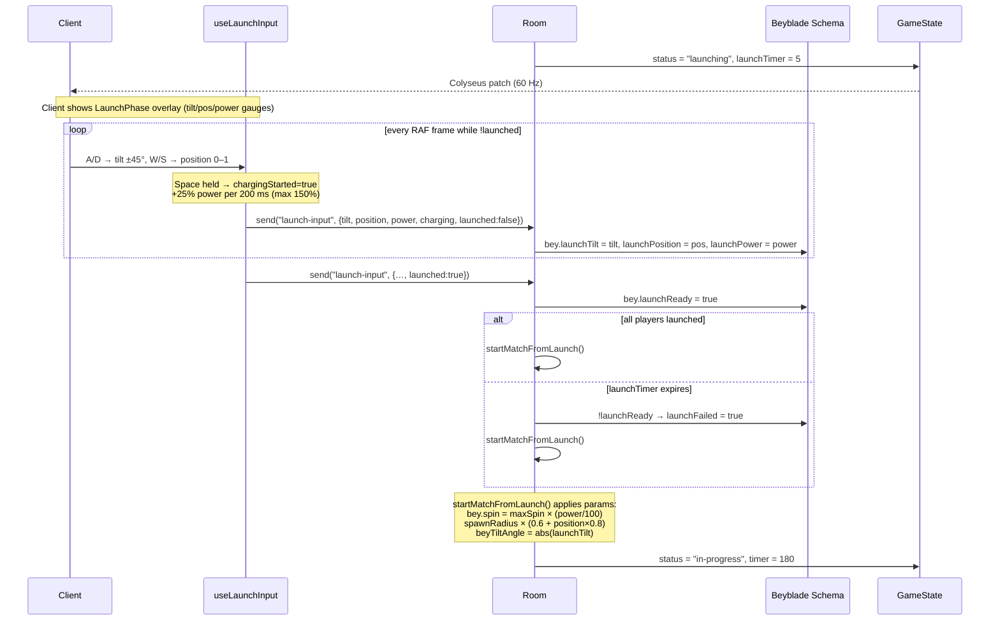
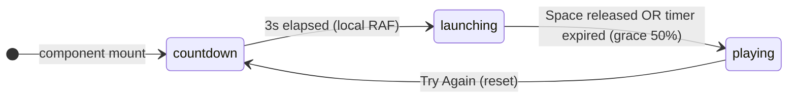
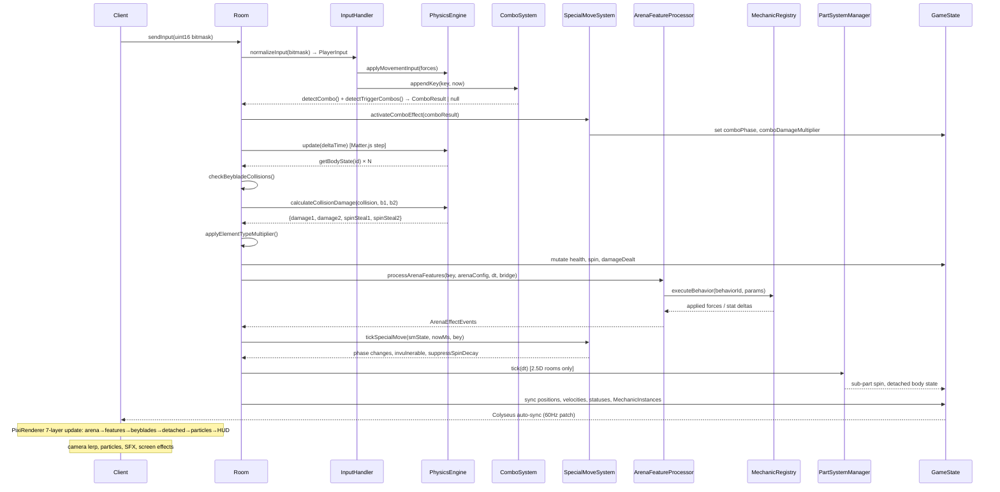
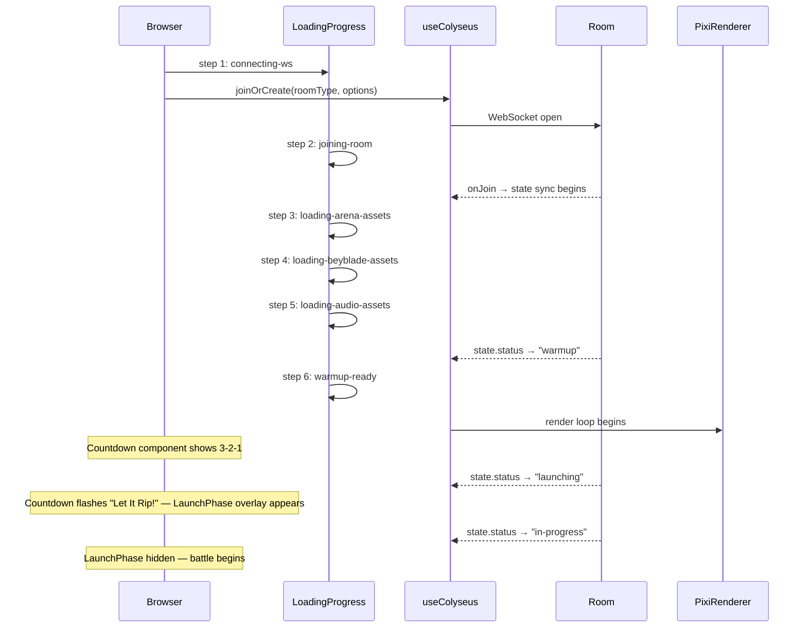

[← Script Execution](diagram-script-execution.md) &nbsp;·&nbsp; [↑ Index](../INDEX.md) &nbsp;·&nbsp; [Simulation Architecture →](diagram-simulation-arch.md)

---

# Diagram: Sequence — Launch to State Update

> **Stage 0C Diagram 6** — Full sequence from pre-match launch QTE through collision to client.

---

## Pre-Match State Machine (all room types)



---

## Launch QTE Sequence (status = "launching")



---

## AI Auto-Launch (AIBattleRoom / TournamentBattleRoom)

AI participants auto-launch ~1.5 s into the launching phase with randomised params:

```
tilt     = rand() × 20           (0–20°)
position = 0.3 + rand() × 0.3   (0.3–0.6 — moderate placement)
power    = 90 + rand() × 30     (90–120%)
```

---

## TryoutGamePage — Local (server-free) Launch Phase

TryoutGamePage has no Colyseus connection; the QTE runs entirely in the browser:



`phaseRef` guards the physics loop — physics only runs in `playing` phase.  
`launchRef` stores tilt/position/power/chargeState in a mutable ref for RAF-safe access.

---

## Launch Parameter Effects on Physics

| Launch Parameter | Value Range | Effect at Match Start |
|---|---|---|
| `launchPower` | 0–150% | `bey.spin = maxSpin × (power / 100)` — 150% gives 1.5× maxSpin |
| `launchPosition` | 0–1 | `spawnRadius × (0.6 + pos × 0.8)` — 0=center (defensive), 1=edge (aggressive) |
| `launchTilt` | −45°→+45° | `beyTiltAngle = Math.abs(launchTilt)` — tilt > 0 → nutation wobble from tick 1 |
| `launchFailed` | bool | Beyblade set `isActive = false` — instant ring-out before physics begins |

---

## In-Match Sequence (after startMatchFromLaunch)



---

## Connection Sequence (client-side)



---

[← Script Execution](diagram-script-execution.md) &nbsp;·&nbsp; [↑ Index](../INDEX.md) &nbsp;·&nbsp; [Simulation Architecture →](diagram-simulation-arch.md)
