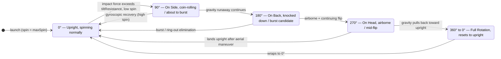
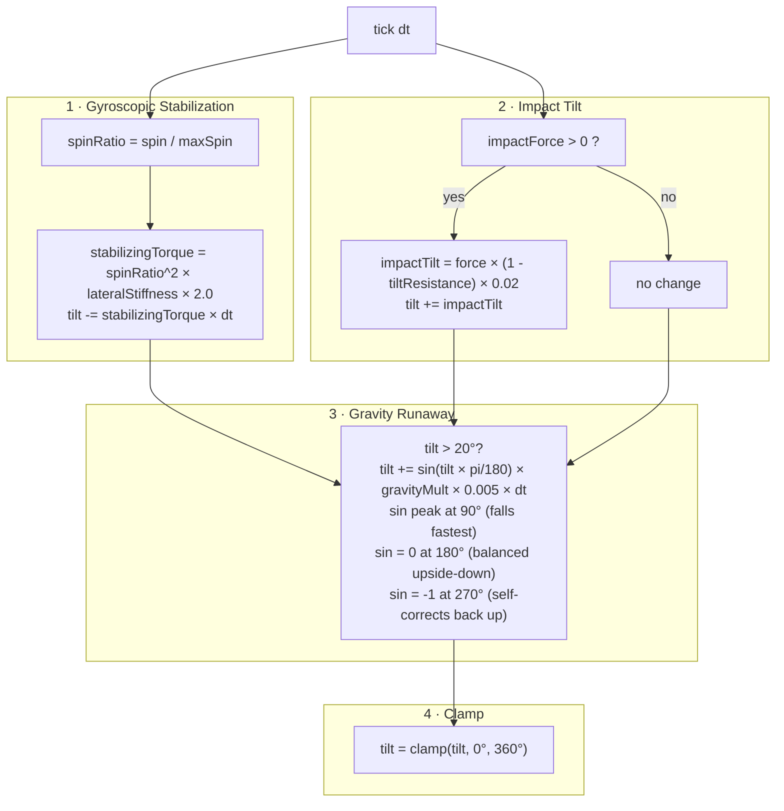

[← Simulation Architecture](diagram-simulation-arch.md) &nbsp;·&nbsp; [↑ Index](../INDEX.md) &nbsp;·&nbsp; [Tool Ecosystem →](diagram-tool-ecosystem.md)

---

# Diagram: Beyblade Tilt Angle System (0°–360°)

> Beyblade tilt angle model — `beyTiltAngle` in `GameState.ts` / `ClimbingPhysics.ts` (2.5D engine).

---

## Tilt State Machine



---

## Physics Forces Per Tick (`updateBeyTilt`)



---

## Gravity Runaway: sin(tilt) Force Direction

```
  tilt     sin(tilt)   effect
  ──────   ─────────   ──────────────────────────────────────────────
    0°        0        no runaway — stable upright
   45°       +0.71     moderate runaway — tilting further
   90°       +1.00     maximum runaway — fastest fall toward on-side
  135°       +0.71     slowing — passed the tipping point
  180°        0        no runaway — unstable upside-down equilibrium
  225°       −0.71     gravity correcting — pulling back toward upright
  270°       −1.00     maximum self-correction — head-down recovery
  315°       −0.71     nearly recovered
  360°        0        stable upright again (wraps to 0°)
```

---

## Renderer Skew Mapping (`PixiRenderer.ts`)

```mermaid
xychart-beta
  title "Visual Skew vs Tilt Angle (sin-based)"
  x-axis [0°, 45°, 90°, 135°, 180°, 225°, 270°, 315°, 360°]
  y-axis "tiltSkewX (radians)" -0.5 --> 0.5
  line [0, 0.28, 0.4, 0.28, 0, -0.28, -0.4, -0.28, 0]
```

> `tiltFrac = Math.sin(tiltAngle × π/180)` → `tiltSkewX = tiltFrac × 0.4`  
> Skew peaks at ±0.4 rad at 90°/270°, returns to 0 at 0°/180°/360°.

---

## Tilt Thresholds & Outcomes

| Tilt Range | `shouldBeRolling` | `shouldBeNormal` | Visual / Game Effect |
|-----------|:-----------------:|:----------------:|----------------------|
| 0°–5°     | false | **true** | Fully upright, no wobble |
| 5°–45°    | false | false | Increasing nutation wobble |
| 45°–90°   | **true** | false | Rolling / tipping — burst risk |
| 90°–180°  | **true** | false | On back — likely burst/ring-out |
| 180°–270° | **true** | false | Airborne flip (on head phase) |
| 270°–360° | **true** | false | Self-correcting back to upright |
| 360° → 0° | — | — | Wraps; treated as full recovery |

---

## Key Fields Referenced

| Field | Location | Role |
|-------|----------|------|
| `beyTiltAngle` | `GameState.ts` (schema) | Synced to client at 60 Hz |
| `tiltResistance` | `ClimbingBeyState` | Scales impact-tilt absorption (0–1) |
| `lateralStiffness` | `ClimbingBeyState` | Gyroscopic auto-recovery rate |
| `gravityMult` | `ClimbingBeyState` | Per-bey gravity scale (affects runaway) |
| `wobbleAmplitude` | `GameState.ts` | `= tilt × spinRatio × 0.5` |
| `tiltSkewX` | `PixiRenderer.ts` | `= sin(tilt × π/180) × 0.4` rad |
| `launchTilt` | `Beyblade` schema | Player-set pre-match tilt (−45°→+45°); sets `beyTiltAngle = Math.abs(launchTilt)` at match start |

---

## Launch Tilt — Pre-Match Parameter (−45° to +45°)

`launchTilt` is set during the 5-second **launch QTE** (A/D keys) before `in-progress`.
It is distinct from the in-match `beyTiltAngle` (0°–360°). On match start:

```
beyTiltAngle = Math.abs(launchTilt)
```

| `launchTilt` | `beyTiltAngle` at t=0 | Effect |
|---|---|---|
| 0° | 0° | Fully upright — maximum gyroscopic stability |
| ±15° | 15° | Slight nutation wobble |
| ±30° | 30° | Moderate wobble — noticeable instability |
| ±45° (max) | 45° | Significant tilt — enters runaway zone quickly if spin drops |

**Shallow tilt** = stable stamina play. **Steep tilt** = aggressive burst-risk style.
Direction (left vs. right) is discarded — only magnitude feeds `beyTiltAngle`.

---

[← Simulation Architecture](diagram-simulation-arch.md) &nbsp;·&nbsp; [↑ Index](../INDEX.md) &nbsp;·&nbsp; [Tool Ecosystem →](diagram-tool-ecosystem.md)
