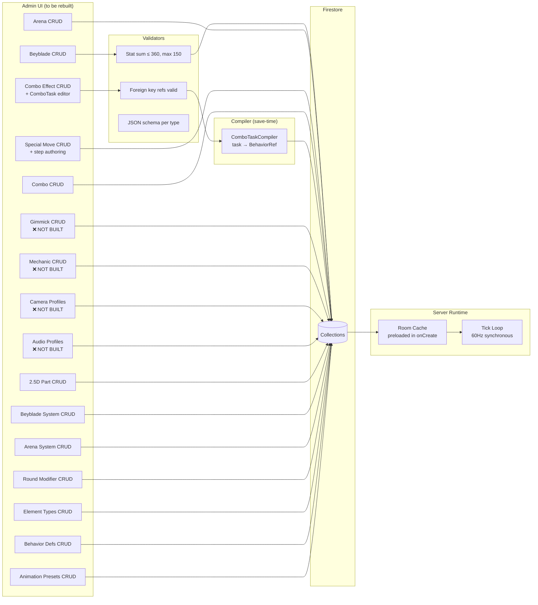

# Diagram: Tool Ecosystem — Admin → DB → Compiler → Runtime

> **Stage 0C Diagram 10** — Rule 9 audit output: how admin tools connect to the engine.

```mermaid
flowchart LR
  subgraph "Admin UI (to be rebuilt)"
    A_BEY[Beyblade CRUD]
    A_ARENA[Arena CRUD]
    A_SM[Special Move CRUD<br/>+ step authoring]
    A_COMBO[Combo CRUD]
    A_CE[Combo Effect CRUD<br/>+ ComboTask editor]
    A_GIMMICK[Gimmick CRUD<br/>❌ NOT BUILT]
    A_MECH[Mechanic CRUD<br/>❌ NOT BUILT]
    A_CAM[Camera Profiles<br/>❌ NOT BUILT]
    A_AUDIO[Audio Profiles<br/>❌ NOT BUILT]
    A_PART[2.5D Part CRUD]
    A_SYSTEM[Beyblade System CRUD]
    A_ARENA_SYS[Arena System CRUD]
    A_RM[Round Modifier CRUD]
    A_ELEM[Element Types CRUD]
    A_BEHAVIOR[Behavior Defs CRUD]
    A_ANIM[Animation Presets CRUD]
  end

  subgraph "Validators"
    V_STAT[Stat sum ≤ 360, max 150]
    V_REF[Foreign key refs valid]
    V_JSON[JSON schema per type]
  end

  subgraph "Compiler (save-time)"
    CTC[ComboTaskCompiler<br/>task → BehaviorRef]
  end

  subgraph "Firestore"
    FS[(Collections)]
  end

  subgraph "Server Runtime"
    RT_CACHE[Room Cache<br/>preloaded in onCreate]
    RT_ENGINE[Tick Loop<br/>60Hz synchronous]
  end

  A_BEY --> V_STAT --> FS
  A_ARENA --> FS
  A_SM --> FS
  A_COMBO --> FS
  A_CE --> V_REF
  V_REF --> CTC
  CTC --> FS
  A_GIMMICK --> FS
  A_MECH --> FS
  A_CAM --> FS
  A_AUDIO --> FS
  A_PART --> FS
  A_SYSTEM --> FS
  A_ARENA_SYS --> FS
  A_RM --> FS
  A_ELEM --> FS
  A_BEHAVIOR --> FS
  A_ANIM --> FS

  FS --> RT_CACHE
  RT_CACHE --> RT_ENGINE
```
