# Diagram: Tool Ecosystem — Admin → DB → Compiler → Runtime

> **Stage 0C Diagram 10** — Rule 9 audit output: how admin tools connect to the engine.

```mermaid
flowchart LR
  subgraph "Admin UI (48 pages total)"
    A_BEY[Beyblade CRUD ✅]
    A_ARENA[Arena CRUD ✅<br/>+ ArenaTestPage]
    A_SM[Special Move CRUD ✅]
    A_COMBO[Combo CRUD ✅]
    A_CE[Combo Effect CRUD ✅<br/>+ ComboTask editor]
    A_GIMMICK[Gimmick CRUD<br/>� NOT BUILT<br/>hardcoded in mechanics/]
    A_CAM[Camera Profiles<br/>� NOT BUILT]
    A_AUDIO[Audio Profiles<br/>� NOT BUILT<br/>SoundAssetsPage = uploads only]
    A_PART[2.5D Part CRUD ✅<br/>8 part type pages]
    A_SYSTEM[Beyblade System CRUD ✅]
    A_ARENA_SYS[Arena System CRUD ✅]
    A_RM[Round Modifier CRUD ✅]
    A_ELEM[Element Types CRUD ✅]
    A_BEHAVIOR[Behavior Defs CRUD ✅<br/>= mechanic behavior registry]
    A_ANIM[Animation Presets ✅]
    A_PARTICLE[Particle Presets ✅]
    A_TURRET[Turret Attack Types ✅]
    A_MATERIAL[Part Materials ✅]
    A_BEYLINK[BeyLink Configs ✅]
    A_ARENA_FEAT[Arena Feature Configs ✅]
    A_AI[AI Battles ✅<br/>+ AIVsAITestPage]
    A_ASSETS[Asset Libraries ✅<br/>theme/obstacle/turret<br/>water/portal/sound]
    A_TOURNAMENT[Tournament CRUD ✅<br/>list/create/edit/detail]
  end

  subgraph "Validators"
    V_STAT[Stat sum ≤ 360, max 150]
    V_REF[Foreign key refs valid]
    V_JSON[JSON schema per type]
  end

  subgraph "Compiler (save-time)"
    CTC[ComboTaskCompiler<br/>task → BehaviorRef]
  end

  subgraph "Firestore (40 collections)"
    FS_BEY[(beyblade_stats)]
    FS_ARENA[(arenas + arena_systems)]
    FS_SM[(special_moves)]
    FS_COMBO[(combos)]
    FS_CE[(combo_effects)]
    FS_BEHAVIOR[(behavior_defs)]
    FS_PART[(8 part collections)]
    FS_RM[(round_modifiers)]
    FS_ELEM[(element_type_configs)]
    FS_ANIM[(animation_presets)]
    FS_PARTICLE[(particle_presets)]
    FS_TOURNAMENT[(tournaments +<br/>tournament_brackets +<br/>tournament_participants)]
    FS_OTHER[(+ 25 more<br/>bey_link_configs, arena_feature_configs<br/>turret_attack_types, part_materials<br/>ai_battles, settings, matches<br/>player_stats, users, sound_assets<br/>obstacle_assets, portal_assets, etc.)]
  end

  subgraph "Server Runtime"
    RT_CACHE[Room Cache<br/>preloaded in onCreate]
    MR[MechanicRegistry<br/>31 namespaced handlers]
    RT_ENGINE[Tick Loop<br/>60Hz synchronous]
  end

  A_BEY --> V_STAT --> FS_BEY
  A_ARENA --> FS_ARENA
  A_SM --> FS_SM
  A_COMBO --> FS_COMBO
  A_CE --> V_REF
  V_REF --> CTC
  CTC --> FS_CE
  A_GIMMICK -.->|NOT BUILT| FS_BEHAVIOR
  A_BEHAVIOR --> FS_BEHAVIOR
  A_PART --> FS_PART
  A_SYSTEM --> FS_ARENA
  A_ARENA_SYS --> FS_ARENA
  A_RM --> FS_RM
  A_ELEM --> FS_ELEM
  A_ANIM --> FS_ANIM
  A_PARTICLE --> FS_PARTICLE
  A_TOURNAMENT --> FS_TOURNAMENT
  A_TURRET --> FS_OTHER
  A_MATERIAL --> FS_OTHER
  A_BEYLINK --> FS_OTHER
  A_ARENA_FEAT --> FS_OTHER
  A_AI --> FS_OTHER
  A_ASSETS --> FS_OTHER

  FS_BEY --> RT_CACHE
  FS_ARENA --> RT_CACHE
  FS_SM --> RT_CACHE
  FS_CE --> RT_CACHE
  FS_COMBO --> RT_CACHE
  FS_BEHAVIOR --> MR
  RT_CACHE --> MR
  MR --> RT_ENGINE
```

## Admin Page Coverage

| Admin Page | Collection | Status |
|-----------|-----------|--------|
| BeybladesList/Create/Edit | beyblade_stats | ✅ |
| ArenasListPage + ArenaEditPage + ArenaTestPage | arenas | ✅ |
| ArenaSystemList/Create/Edit | arena_systems | ✅ |
| SpecialMovesPage | special_moves | ✅ |
| CombosPage | combos | ✅ |
| ComboEffectsPage | combo_effects | ✅ |
| BehaviorDefsPage | behavior_defs | ✅ |
| RoundModifiersPage | round_modifiers | ✅ |
| ElementTypesList/Edit | element_type_configs | ✅ |
| AnimationPresetsPage | animation_presets | ✅ |
| ParticlePresetsPage | particle_presets | ✅ |
| TurretAttackTypesPage | turret_attack_types | ✅ |
| PartMaterialsPage | part_materials | ✅ |
| BeyLinkConfigsPage | bey_link_configs | ✅ |
| ArenaFeatureConfigsPage | arena_feature_configs | ✅ |
| AIBattlesPage + AIVsAITestPage | ai_battles | ✅ |
| TournamentsList/Create/Edit/Detail | tournaments + brackets + participants | ✅ |
| 2D PartList/Create/Edit (×8 types) | 8 part collections | ✅ |
| BeybladeSystemList/Create/Edit | beyblade_systems | ✅ |
| ArenaFloorGroupList/Editor | arenas (floor groups) | ✅ |
| Assets (6 library pages) | *_assets collections | ✅ |
| Gimmick CRUD | gimmick_defs | � NOT BUILT — mechanics hardcoded in server |
| Camera Profiles | camera_profiles | � NOT BUILT |
| Audio Profiles | audio_profiles | � NOT BUILT — SoundAssetsPage is upload-only |

---
[? Tilt Angle](diagram-tilt-angle.md)  ·  [? Index](../INDEX.md)
