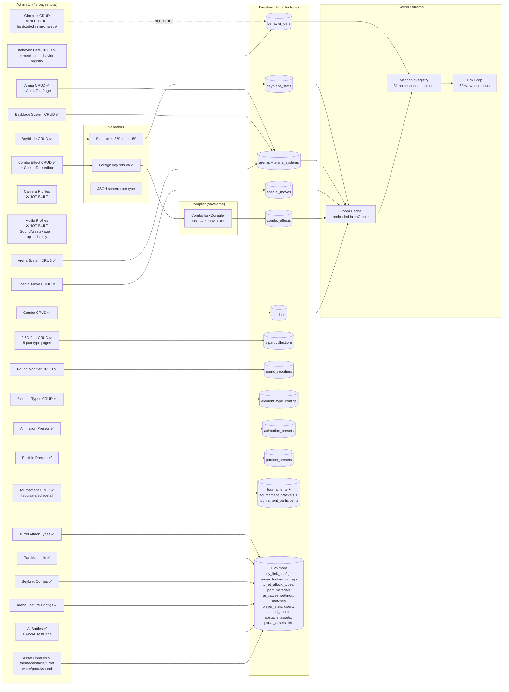

[← Tilt Angle](diagram-tilt-angle.md) &nbsp;·&nbsp; [↑ Index](../INDEX.md) &nbsp;·&nbsp; [Turret Power-Up System →](diagram-turret-powerup-system.md)

---

# Diagram: Tool Ecosystem — Admin → DB → Compiler → Runtime

> **Stage 0C Diagram 10** — Rule 9 audit output: how admin tools connect to the engine.

## Admin Page Coverage

| Admin Page | Collection | Status |
|-----------|-----------|--------|
| BeybladesList/Create/Edit | beyblade_stats | ✅ |
| ArenasListPage + ArenaEditPage + ArenaTestPage | arenas | ✅ |
| ArenaSystemList/Create/Edit | arena_systems | ✅ |
| SpecialMovesPage | special_moves | ✅ |
| CombosPage | combos | ✅ |
| ComboEffectsPage | combo_effects | ✅ |
| BehaviorDefsPage | behavior_defs | ✅ |
| RoundModifiersPage | round_modifiers | ✅ |
| ElementTypesList/Edit | element_type_configs | ✅ |
| AnimationPresetsPage | animation_presets | ✅ |
| ParticlePresetsPage | particle_presets | ✅ |
| TurretAttackTypesPage | turret_attack_types | ✅ |
| PartMaterialsPage | part_materials | ✅ |
| BeyLinkConfigsPage | bey_link_configs | ✅ |
| ArenaFeatureConfigsPage | arena_feature_configs | ✅ |
| AIBattlesPage + AIVsAITestPage | ai_battles | ✅ |
| TournamentsList/Create/Edit/Detail | tournaments + brackets + participants | ✅ |
| 2D PartList/Create/Edit (×8 types) | 8 part collections | ✅ |
| BeybladeSystemList/Create/Edit | beyblade_systems | ✅ |
| ArenaFloorGroupList/Editor | arenas (floor groups) | ✅ |
| Assets (6 library pages) | *_assets collections | ✅ |
| Gimmick CRUD | gimmick_defs | ❌ NOT BUILT — mechanics hardcoded in server |
| Camera Profiles | camera_profiles | ❌ NOT BUILT |
| Audio Profiles | audio_profiles | ❌ NOT BUILT — SoundAssetsPage is upload-only |

---

[← Tilt Angle](diagram-tilt-angle.md) &nbsp;·&nbsp; [↑ Index](../INDEX.md) &nbsp;·&nbsp; [Turret Power-Up System →](diagram-turret-powerup-system.md)
