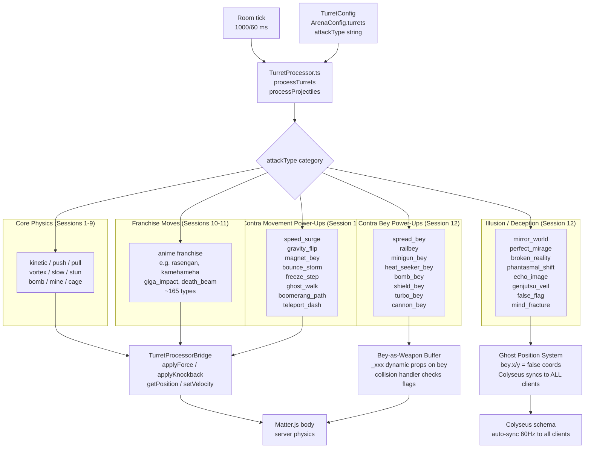
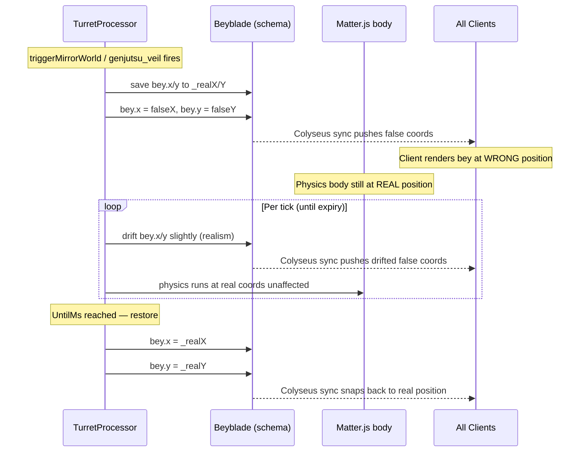
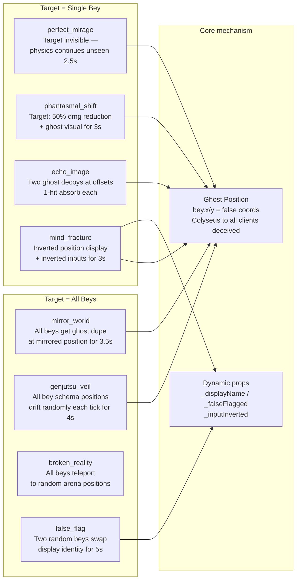
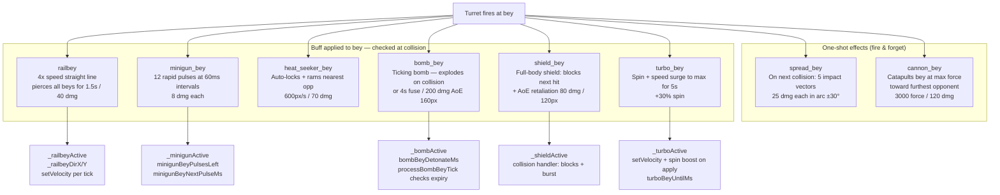
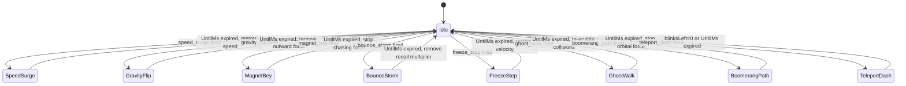
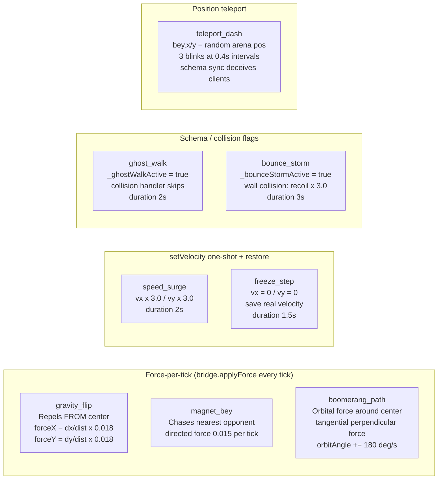
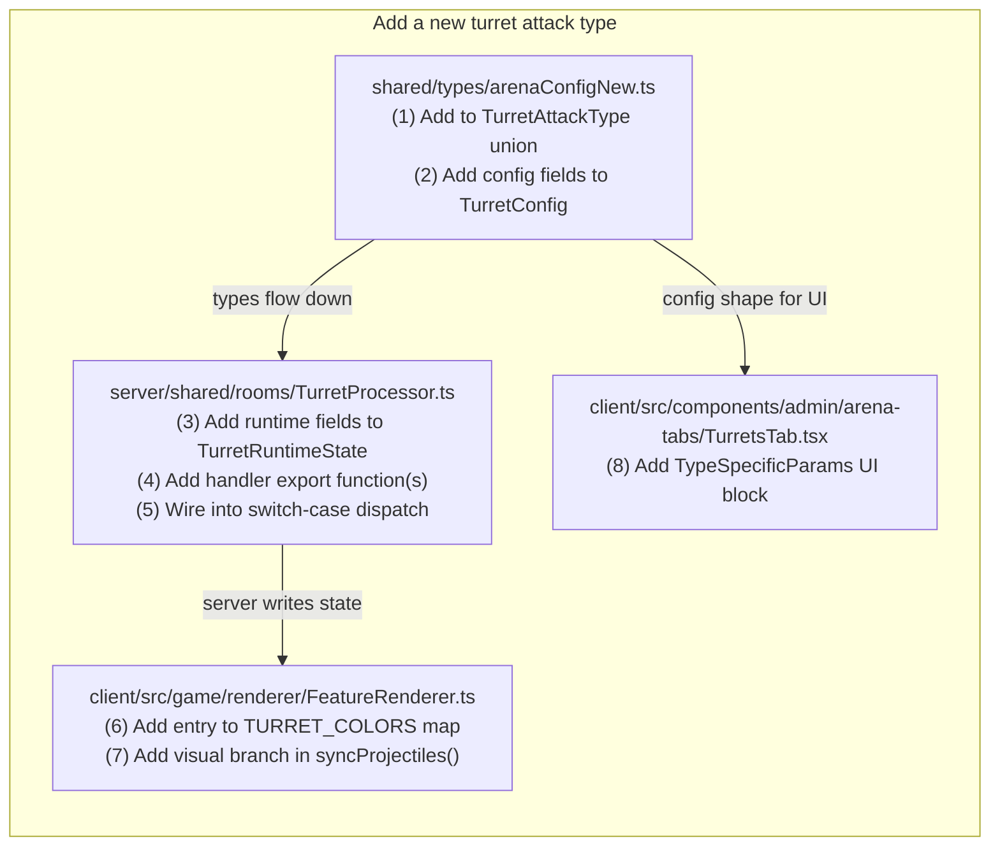
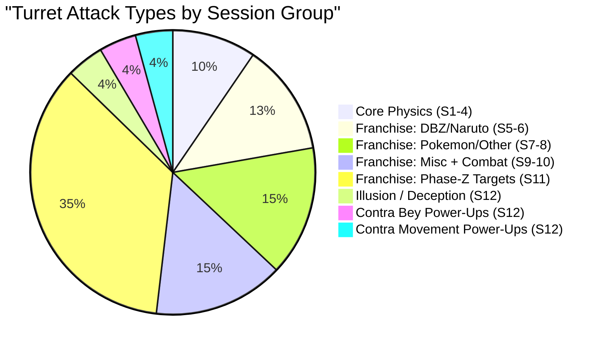

# Diagram: Turret Attack Power-Up System

> Session 12 additions — Illusion, Contra bey-as-weapon, and Contra movement power-ups.

---

## Diagram 1 — Overall Turret Attack Dispatch Flow

---

## Diagram 2 — Ghost / Illusion Position Pattern

---

## Diagram 3 — Eight Illusion Move Taxonomy

---

## Diagram 4 — Contra Bey-as-Weapon Power-Up Flow

---

## Diagram 5 — Contra Movement Power-Up State Machine

---

## Diagram 6 — Contra Movement Power-Up Mechanics Table

---

## Diagram 7 — 4-File Implementation Pattern

---

## Diagram 8 — Full Attack Type Count (Sessions 1–12)

